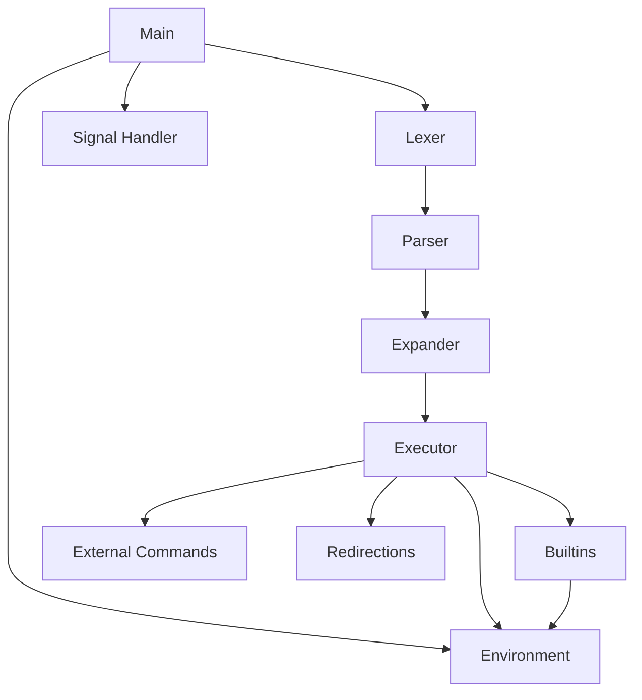

# 🖥️ MINISHELL KAPSAMLı PROJE DOKÜMANTASYONU

## 📖 İçindekiler
1. [Proje Genel Bakış](#proje-genel-bakış)
2. [Mimari ve Modül Yapısı](#mimari-ve-modül-yapısı)
3. [Veri Yapıları](#veri-yapıları)
4. [Kod Akışı](#kod-akışı)
5. [Modül Detayları](#modül-detayları)
6. [Örnek Senaryolar](#örnek-senaryolar)
7. [Hata Yönetimi](#hata-yönetimi)
8. [Test ve Debug](#test-ve-debug)

---

## 🎯 Proje Genel Bakış

### Minishell Nedir?
Minishell, UNIX/Linux kabuk (shell) programının basitleştirilmiş bir versiyonudur. Bash kabuğunun temel özelliklerini implemente eder:

- **Komut Çalıştırma**: Sistem komutlarını ve yerleşik komutları çalıştırır
- **Pipe İşlemleri**: Komutlar arası veri akışı sağlar (`ls | grep txt`)
- **Yönlendirme**: Giriş/çıkış yönlendirmeleri (`>`, `>>`, `<`, `<<`)
- **Değişken Genişletme**: Çevre değişkenlerini ve özel değişkenleri işler (`$HOME`, `$?`)
- **Tırnak İşleme**: Tek ve çift tırnakları doğru şekilde ayrıştırır
- **Yerleşik Komutlar**: `cd`, `echo`, `env`, `exit`, `export`, `pwd`, `unset`

### Temel Çalışma Prensibi
```
Kullanıcı Girdisi → Lexical Analysis → Parsing → Expansion → Execution → Sonuç
```

---

## 🏗️ Mimari ve Modül Yapısı

### Proje Dizin Yapısı
```
minishell/
├── lib/                     # Header dosyaları
│   └── minishell.h         # Ana header
├── source/                  # Kaynak kodlar
│   ├── core/               # Ana program mantığı
│   ├── lexer/              # Lexical analysis
│   ├── parser/             # Syntax analysis
│   ├── expander/           # Variable expansion
│   ├── executer/           # Command execution
│   ├── builtins/           # Yerleşik komutlar
│   ├── environment/        # Çevre değişken yönetimi
│   ├── redirection/        # I/O yönlendirme
│   ├── signal/             # Sinyal yönetimi
│   └── utils/              # Yardımcı fonksiyonlar
├── include/libft/          # Libft kütüphanesi
└── objects/                # Compiled object files
```

### Modüller Arası İlişki


---

## 📊 Veri Yapıları

### Global State (t_global)
Tüm programın durumunu tutan merkezi yapı:

```c
typedef struct s_global
{
    t_list      *tokens;         // Ayrıştırılan token listesi
    t_command   *commands;       // Parse edilmiş komut listesi
    t_env       *env_list;       // Çevre değişkenleri
    int         exit_status;     // Son komutun exit durumu
    int         pipe_count;      // Mevcut pipe sayısı
    int         heredoc_count;   // Heredoc sayısı
    char        *input_line;     // İşlenen girdi satırı
    int         interactive;     // Etkileşimli mod flag'i
    int         in_child;        // Child process flag'i
    int         should_exit;     // Çıkış flag'i
    int         heredoc_fds[MAX_HEREDOC_FDS]; // Heredoc FD'leri
    int         heredoc_fd_count; // Heredoc FD sayısı
} t_global;
```

**Kullanım Örneği:**
```c
t_global *global = get_global(); // Singleton pattern
global->exit_status = 0;         // Başarılı çıkış
```

### Token Yapısı (t_token_new)
Lexical analysis sonucu oluşan token'lar:

```c
typedef struct s_token_new
{
    t_token_types   type;        // Token türü (T_WORD, T_PIPE, vb.)
    char           *value;       // Token değeri
    int            len;          // Değer uzunluğu
    int            quote_type;   // Tırnak türü (0=yok, 1=tek, 2=çift)
    int            expanded;     // Genişletme yapıldı mı?
} t_token_new;
```

**Token Türleri:**
```c
typedef enum e_token_types
{
    T_WORD,             // "ls", "file.txt"
    T_CMD,              // Komut işaretleyici
    T_PIPE,             // "|"
    T_REDIRECT_IN,      // "<"
    T_REDIRECT_OUT,     // ">"
    T_APPEND,           // ">>"
    T_HEREDOC,          // "<<"
    T_SINGLE_QUOTE,     // 'text'
    T_DOUBLE_QUOTE,     // "text"
    T_ENV_VAR,          // $VAR
    T_WHITESPACE,       // Boşluk
    T_EOF               // Girdi sonu
} t_token_types;
```

### Komut Yapısı (t_command)
Parse edilmiş komut bilgilerini tutar:

```c
typedef struct s_command
{
    char            **args;         // Komut ve argümanları ["ls", "-l", NULL]
    t_list          *redirections;  // Yönlendirme listesi
    int             pipe_fd[2];     // Pipe file descriptors
    pid_t           pid;            // Process ID
    struct s_command *next;         // Pipeline'daki sonraki komut
} t_command;
```

**Örnek Komut Yapısı:**
```bash
ls -l | grep txt > output.txt
```
Bu komut için üç ayrı `t_command` yapısı oluşur:
1. `args: ["ls", "-l", NULL]`, `pipe_fd[1]` output olarak ayarlanır
2. `args: ["grep", "txt", NULL]`, input/output pipe'lar ayarlanır  
3. `args: [...]` ve `redirections` listesinde `output.txt` bulunur

### Çevre Değişkeni Yapısı (t_env)
Çevre değişkenlerini bağlı liste olarak tutar:

```c
typedef struct s_env
{
    char        *key;      // Değişken adı ("HOME", "PATH")
    char        *value;    // Değişken değeri ("/home/user")
    struct s_env *next;    // Sonraki node
} t_env;
```

---

## 🔄 Kod Akışı

### Ana Program Akışı (main.c)

```c
int main(int argc, char **argv, char **envp)
{
    // 1. Global state'i başlat
    t_global *global = get_global();
    global = init_global(envp, global);
    
    // 2. Sinyalleri ayarla
    setup_signals();
    
    // 3. Ana shell döngüsü
    run_shell_loop(global);
    
    // 4. Temizlik ve çıkış
    cleanup_and_exit();
    return (0);
}
```

### Shell Döngüsü Detayı

```c
static void run_shell_loop(t_global *global)
{
    char *input;
    
    while (!global->should_exit)
    {
        // 1. Kullanıcıdan girdi al
        input = readline(PROMPT);
        
        // 2. EOF kontrolü (Ctrl+D)
        if (!input) {
            handle_eof();
            break;
        }
        
        // 3. Girdiyi işle
        process_input(input, global);
        
        // 4. Bellek temizliği
        free(input);
    }
}
```

### Girdi İşleme Süreci

```c
static int process_input(char *input, t_global *global)
{
    t_list *tokens;
    t_command *commands;
    
    // 1. Boş girdi kontrolü
    if (!input || ft_strlen(input) == 0)
        return (0);
    
    // 2. History'ye ekle
    add_history(input);
    
    // 3. LEXER: Girdiyi token'lara çevir
    tokens = tokenize_advanced(input, global);
    if (!tokens) {
        global->exit_status = 2;
        return (0);
    }
    
    // 4. PARSER: Token'ları komutlara çevir
    commands = parse_tokens_to_commands(tokens, global);
    if (!commands) {
        global->exit_status = 2;
        return (0);
    }
    
    // 5. EXECUTOR: Komutları çalıştır
    if (commands)
        global->exit_status = execute_commands(commands, global);
    
    return (0);
}
```

---

## 🔍 Modül Detayları

### 1. LEXER (Lexical Analysis)

**Görev**: Ham string girdiyi anlamlı token'lara ayırır.

**Ana Fonksiyonlar:**
```c
// Lexer başlatma
t_lexer_new *init_lexer_advanced(char *input, t_global *global)
{
    t_lexer_new *lexer = halloc(sizeof(t_lexer_new));
    lexer->input = input;
    lexer->pos = 0;
    lexer->len = ft_strlen(input);
    lexer->current_char = input[0];
    return (lexer);
}

// Ana tokenization fonksiyonu
t_list *tokenize_advanced(char *input, t_global *global)
{
    t_lexer_new *lexer;
    t_list *tokens = NULL;
    t_token_new *token;
    
    lexer = init_lexer_advanced(input, global);
    
    while (lexer->current_char != '\0')
    {
        skip_whitespace_advanced(lexer);
        
        if (lexer->current_char == '|')
            token = handle_pipe_advanced(lexer);
        else if (lexer->current_char == '<' || lexer->current_char == '>')
            token = handle_redirect_advanced(lexer);
        else if (lexer->current_char == '\'' || lexer->current_char == '"')
            token = handle_quotes_advanced(lexer);
        else
            token = handle_word_advanced(lexer, &first_word_check);
        
        if (token)
            ft_lstadd_back(&tokens, ft_lstnew(token));
    }
    
    return (tokens);
}
```

**Lexer Örnekleri:**

1. **Basit Komut**: `ls -l`
   ```
   Input: "ls -l"
   Tokens: [T_WORD:"ls", T_WORD:"-l"]
   ```

2. **Pipe ile**: `ls | grep txt`
   ```
   Input: "ls | grep txt"
   Tokens: [T_WORD:"ls", T_PIPE:"|", T_WORD:"grep", T_WORD:"txt"]
   ```

3. **Yönlendirme**: `cat < input.txt > output.txt`
   ```
   Input: "cat < input.txt > output.txt"
   Tokens: [T_WORD:"cat", T_REDIRECT_IN:"<", T_WORD:"input.txt", 
            T_REDIRECT_OUT:">", T_WORD:"output.txt"]
   ```

4. **Tırnaklar**: `echo "Hello World" 'test'`
   ```
   Input: "echo \"Hello World\" 'test'"
   Tokens: [T_WORD:"echo", T_DOUBLE_QUOTE:"Hello World", T_SINGLE_QUOTE:"test"]
   ```

### 2. PARSER (Syntax Analysis)

**Görev**: Token'ları komut yapılarına dönüştürür ve syntax kontrolü yapar.

**Ana Fonksiyonlar:**
```c
// Ana parsing fonksiyonu
t_command *parse_tokens_to_commands(t_list *tokens, t_global *global)
{
    t_command *head = NULL;
    t_command *current = NULL;
    t_list *token_node = tokens;
    
    while (token_node)
    {
        if (is_command_start(token_node))
        {
            current = parse_single_command(&token_node, global);
            if (!head)
                head = current;
            else
                append_command_to_chain(head, current);
        }
        else
            token_node = token_node->next;
    }
    
    return (head);
}

// Tek komut ayrıştırma
t_command *parse_single_command(t_list **token_node, t_global *global)
{
    t_command *cmd = create_command();
    t_list *args_list = NULL;
    t_list *current = *token_node;
    
    // Syntax kontrolü
    if (check_syntax(token_node))
        return (NULL);
    
    // Pipe'a kadar olan token'ları işle
    while (current && !is_pipe_token(current))
    {
        if (is_redirect_token(current))
            parse_redirection(cmd, &current, global);
        else if (is_word_token(current))
            collect_command_arg(&args_list, current);
        
        current = current->next;
    }
    
    // Args listesini array'e çevir
    cmd->args = convert_list_to_array(args_list);
    
    // Variable expansion uygula
    expand_command_args(cmd, global);
    
    return (cmd);
}
```

**Parser Örnekleri:**

1. **Basit Komut**: `ls -l`
   ```c
   t_command {
       args: ["ls", "-l", NULL],
       redirections: NULL,
       next: NULL
   }
   ```

2. **Pipeline**: `ls -l | grep txt`
   ```c
   // İlk komut
   t_command {
       args: ["ls", "-l", NULL],
       redirections: NULL,
       pipe_fd: [3, 4],  // output pipe
       next: [ikinci_komut]
   }
   
   // İkinci komut
   t_command {
       args: ["grep", "txt", NULL],
       redirections: NULL,
       pipe_fd: [3, 4],  // input pipe
       next: NULL
   }
   ```

3. **Yönlendirmeli Komut**: `cat < input.txt > output.txt`
   ```c
   t_command {
       args: ["cat", NULL],
       redirections: [
           {type: T_REDIRECT_IN, filename: "input.txt"},
           {type: T_REDIRECT_OUT, filename: "output.txt"}
       ],
       next: NULL
   }
   ```

### 3. EXPANDER (Variable Expansion)

**Görev**: Değişkenleri, tırnakları ve özel karakterleri işler.

**Ana Fonksiyonlar:**
```c
// Ana expansion fonksiyonu
char *expand_variables(char *input, t_global *global)
{
    char *result = NULL;
    char *temp;
    int i = 0;
    
    while (input[i])
    {
        if (input[i] == '$')
        {
            temp = handle_dollar_expansion(input, &i, global);
            result = join_and_free(result, temp);
        }
        else
        {
            temp = handle_regular_char(input, &i);
            result = join_and_free(result, temp);
        }
    }
    
    return (result);
}

// Dollar expansion işleme
char *handle_dollar_expansion(char *input, int *i, t_global *global)
{
    char *var_name;
    char *var_value;
    int start = *i + 1; // '$' karakterini atla
    int end = start;
    
    // Değişken adının sonunu bul
    while (input[end] && (ft_isalnum(input[end]) || input[end] == '_'))
        end++;
    
    // Özel değişkenler
    if (input[start] == '?')
    {
        *i = start + 1;
        return (ft_itoa(global->exit_status));
    }
    
    // Normal değişken
    var_name = ft_substr(input, start, end - start);
    var_value = get_env_value(global->env_list, var_name);
    
    *i = end;
    free(var_name);
    
    return (var_value ? ft_strdup(var_value) : ft_strdup(""));
}

// Tırnak işleme
char *expand_with_quotes(char *input, t_global *global)
{
    int quote_state = 0; // 0=none, 1=single, 2=double
    char *result = NULL;
    int i = 0;
    
    while (input[i])
    {
        update_quote_state(input[i], &quote_state);
        
        if (quote_state == 1) // Single quote - literal
        {
            result = join_char(result, input[i]);
        }
        else if (quote_state == 2) // Double quote - expand variables
        {
            if (input[i] == '$')
                result = join_and_free(result, handle_dollar_expansion(input, &i, global));
            else
                result = join_char(result, input[i]);
        }
        else // No quotes
        {
            if (input[i] == '$')
                result = join_and_free(result, handle_dollar_expansion(input, &i, global));
            else
                result = join_char(result, input[i]);
        }
        
        i++;
    }
    
    return (result);
}
```

**Expansion Örnekleri:**

1. **Basit Değişken**: `echo $HOME`
   ```
   Input: "echo $HOME"
   Expanded: "echo /home/username"
   ```

2. **Exit Status**: `echo $?`
   ```
   Input: "echo $?"
   Expanded: "echo 0" (son komutun exit status'u)
   ```

3. **Tek Tırnak**: `echo '$HOME'`
   ```
   Input: "echo '$HOME'"
   Expanded: "echo $HOME" (literal, expansion yok)
   ```

4. **Çift Tırnak**: `echo "$HOME"`
   ```
   Input: "echo \"$HOME\""
   Expanded: "echo \"/home/username\""
   ```

5. **Karışık**: `echo "User: $USER, Home: $HOME"`
   ```
   Input: "echo \"User: $USER, Home: $HOME\""
   Expanded: "echo \"User: hasivaci, Home: /home/hasivaci\""
   ```

### 4. EXECUTOR (Command Execution)

**Görev**: Parse edilmiş komutları çalıştırır, pipe'ları ve yönlendirmeleri yönetir.

**Ana Fonksiyonlar:**
```c
// Ana execution fonksiyonu
int execute_commands(t_command *commands, t_global *global)
{
    int exit_status = 0;
    
    if (!commands)
        return (0);
    
    // Heredoc'ları önceden işle
    preprocess_heredocs(commands, global);
    
    // Tek komut mu pipeline mi?
    if (!commands->next)
        exit_status = execute_single_command(commands, global);
    else
        exit_status = execute_pipeline(commands, global);
    
    return (exit_status);
}

// Tek komut çalıştırma
int execute_single_command(t_command *cmd, t_global *global)
{
    int original_fds[2];
    int exit_status;
    
    // Original FD'leri kaydet
    original_fds[0] = dup(STDIN_FILENO);
    original_fds[1] = dup(STDOUT_FILENO);
    
    // Yönlendirmeleri ayarla
    setup_redirections(cmd);
    
    // Built-in mi kontrol et
    if (is_builtin(cmd->args[0]))
        exit_status = execute_builtin(cmd, global, original_fds);
    else
        exit_status = execute_external_command(cmd, global);
    
    // FD'leri geri yükle
    dup2(original_fds[0], STDIN_FILENO);
    dup2(original_fds[1], STDOUT_FILENO);
    close(original_fds[0]);
    close(original_fds[1]);
    
    return (exit_status);
}

// Pipeline çalıştırma
int execute_pipeline(t_command *commands, t_global *global)
{
    t_command *current = commands;
    int prev_fd = -1;
    int pipe_fd[2];
    pid_t *pids;
    int cmd_count = 0;
    int exit_status = 0;
    
    // Komut sayısını say
    while (current) {
        cmd_count++;
        current = current->next;
    }
    
    pids = halloc(sizeof(pid_t) * cmd_count);
    current = commands;
    
    for (int i = 0; i < cmd_count; i++)
    {
        // Son komut değilse pipe oluştur
        if (i < cmd_count - 1)
        {
            if (pipe(pipe_fd) == -1) {
                perror("pipe");
                return (1);
            }
        }
        
        // Komutu async olarak çalıştır
        pids[i] = execute_pipeline_command_async(current, global, prev_fd, 
                                                (i < cmd_count - 1) ? pipe_fd : NULL);
        
        // Önceki pipe'ın read ucunu kapat
        if (prev_fd != -1)
            close(prev_fd);
        
        // Pipe'ın write ucunu kapat ve read ucunu sakla
        if (i < cmd_count - 1)
        {
            close(pipe_fd[1]);
            prev_fd = pipe_fd[0];
        }
        
        current = current->next;
    }
    
    // Tüm process'leri bekle
    for (int i = 0; i < cmd_count; i++)
    {
        int status;
        waitpid(pids[i], &status, 0);
        if (i == cmd_count - 1) // Son komutun exit status'u
            exit_status = WEXITSTATUS(status);
    }
    
    free(pids);
    return (exit_status);
}
```

**Execution Örnekleri:**

1. **Basit Komut**: `ls -l`
   ```c
   // Single command execution
   execute_single_command() -> fork() -> execve("/bin/ls", ["ls", "-l"], envp)
   ```

2. **Pipeline**: `ls -l | grep txt | wc -l`
   ```
   Process 1: ls -l        (stdout -> pipe1)
   Process 2: grep txt     (stdin <- pipe1, stdout -> pipe2)
   Process 3: wc -l        (stdin <- pipe2)
   
   Parent: wait for all processes, return exit status of last command
   ```

3. **Yönlendirme**: `cat < input.txt > output.txt`
   ```c
   // Setup redirections
   int input_fd = open("input.txt", O_RDONLY);
   int output_fd = open("output.txt", O_WRONLY | O_CREAT | O_TRUNC, 0644);
   
   dup2(input_fd, STDIN_FILENO);
   dup2(output_fd, STDOUT_FILENO);
   
   // Execute
   execve("/bin/cat", ["cat"], envp);
   ```

### 5. BUILTINS (Yerleşik Komutlar)

**Görev**: Shell'in kendi komutlarını implement eder.

**Yerleşik Komut Listesi:**
- `cd` - Dizin değiştirme
- `echo` - Metin yazdırma
- `env` - Çevre değişkenlerini listeleme
- `exit` - Shell'den çıkış
- `export` - Çevre değişkeni dışa aktarma
- `pwd` - Mevcut dizini gösterme
- `unset` - Çevre değişkeni silme

**Örnek Implementasyonlar:**

```c
// cd komutu
int builtin_cd(char **args, t_global *global)
{
    char *path;
    char *old_pwd;
    
    // Argüman kontrolü
    if (!args[1]) // cd without arguments
        path = get_env_value(global->env_list, "HOME");
    else if (ft_strcmp(args[1], "-") == 0) // cd -
        path = get_env_value(global->env_list, "OLDPWD");
    else
        path = args[1];
    
    if (!path) {
        ft_putendl_fd("cd: HOME not set", STDERR_FILENO);
        return (1);
    }
    
    // Mevcut dizini kaydet
    old_pwd = get_env_value(global->env_list, "PWD");
    
    // Dizin değiştir
    if (chdir(path) == -1) {
        perror("cd");
        return (1);
    }
    
    // Çevre değişkenlerini güncelle
    set_env_var(global, "OLDPWD", old_pwd);
    update_pwd_env(global);
    
    return (0);
}

// echo komutu
int builtin_echo(char **args)
{
    int i = 1;
    int newline = 1; // Default olarak newline ekle
    
    // -n flag kontrolü
    if (args[1] && ft_strcmp(args[1], "-n") == 0) {
        newline = 0;
        i = 2;
    }
    
    // Argümanları yazdır
    while (args[i])
    {
        printf("%s", remove_quotes(args[i]));
        if (args[i + 1])
            printf(" ");
        i++;
    }
    
    if (newline)
        printf("\n");
    
    return (0);
}

// export komutu
int builtin_export(char **args, t_global *global)
{
    int i = 1;
    
    // Argüman yoksa tüm değişkenleri yazdır
    if (!args[1]) {
        print_export_env(global->env_list);
        return (0);
    }
    
    // Her argümanı işle
    while (args[i])
    {
        char *key, *value;
        char *equals = ft_strchr(args[i], '=');
        
        if (equals) {
            // key=value formatı
            *equals = '\0';
            key = args[i];
            value = equals + 1;
            set_env_var(global, key, value);
        } else {
            // Sadece key (export-only)
            key = args[i];
            // Eğer değişken yoksa boş değerle oluştur
            if (!find_env_node(global->env_list, key))
                set_env_var(global, key, "");
        }
        i++;
    }
    
    return (0);
}
```

### 6. ENVIRONMENT (Çevre Değişken Yönetimi)

**Görev**: Çevre değişkenlerini yönetir ve PATH resolution yapar.

```c
// Çevre değişkeni listesini başlatma
t_env *init_env_from_envp(char **envp)
{
    t_env *env_list = NULL;
    int i = 0;
    
    while (envp[i])
    {
        char *equals = ft_strchr(envp[i], '=');
        if (equals) {
            *equals = '\0';
            char *key = envp[i];
            char *value = equals + 1;
            
            t_env *node = create_env_node(key, value);
            add_env_node(&env_list, node);
            
            *equals = '='; // Restore original string
        }
        i++;
    }
    
    return (env_list);
}

// PATH'de komut arama
char *find_command_path(char *command, t_env *env_list)
{
    char *path_env;
    char **paths;
    char *full_path;
    int i = 0;
    
    // Built-in path kontrolü
    if (access(command, X_OK) == 0)
        return (ft_strdup(command));
    
    // PATH çevre değişkenini al
    path_env = get_env_value(env_list, "PATH");
    if (!path_env)
        return (NULL);
    
    // PATH'i ':'ye göre böl
    paths = ft_split(path_env, ':');
    
    while (paths[i])
    {
        full_path = build_full_path(paths[i], command);
        if (access(full_path, X_OK) == 0)
        {
            free_string_array(paths);
            return (full_path);
        }
        free(full_path);
        i++;
    }
    
    free_string_array(paths);
    return (NULL);
}
```

### 7. REDIRECTION (I/O Yönlendirme)

**Görev**: Giriş/çıkış yönlendirmelerini yönetir.

```c
// Yönlendirmeleri ayarlama
void setup_redirections(t_command *cmd)
{
    t_list *current = cmd->redirections;
    
    while (current)
    {
        t_redirect *redirect = (t_redirect *)current->content;
        handle_single_redirection(redirect);
        current = current->next;
    }
}

// Tek yönlendirme işleme
void handle_single_redirection(t_redirect *redirect)
{
    int fd;
    
    switch (redirect->type)
    {
        case T_REDIRECT_IN: // <
            fd = open(redirect->filename, O_RDONLY);
            if (fd == -1) {
                perror(redirect->filename);
                exit(1);
            }
            dup2(fd, STDIN_FILENO);
            close(fd);
            break;
            
        case T_REDIRECT_OUT: // >
            fd = open(redirect->filename, O_WRONLY | O_CREAT | O_TRUNC, 0644);
            if (fd == -1) {
                perror(redirect->filename);
                exit(1);
            }
            dup2(fd, STDOUT_FILENO);
            close(fd);
            break;
            
        case T_APPEND: // >>
            fd = open(redirect->filename, O_WRONLY | O_CREAT | O_APPEND, 0644);
            if (fd == -1) {
                perror(redirect->filename);
                exit(1);
            }
            dup2(fd, STDOUT_FILENO);
            close(fd);
            break;
            
        case T_HEREDOC: // <<
            handle_heredoc(redirect);
            break;
    }
}

// Heredoc işleme
int handle_heredoc(t_redirect *redirect)
{
    int pipe_fd[2];
    char *line;
    
    if (pipe(pipe_fd) == -1) {
        perror("pipe");
        return (-1);
    }
    
    // Delimiter'a kadar input al
    while (1)
    {
        line = readline("> ");
        if (!line || ft_strcmp(line, redirect->filename) == 0)
        {
            free(line);
            break;
        }
        
        write(pipe_fd[1], line, ft_strlen(line));
        write(pipe_fd[1], "\n", 1);
        free(line);
    }
    
    close(pipe_fd[1]);
    dup2(pipe_fd[0], STDIN_FILENO);
    register_heredoc_fd(pipe_fd[0]); // FD leak önleme
    
    return (pipe_fd[0]);
}
```

### 8. SIGNAL (Sinyal Yönetimi)

**Görev**: Klavye sinyallerini (Ctrl+C, Ctrl+\\, Ctrl+D) yönetir.

```c
// Sinyal handler'larını ayarlama
void setup_signals(void)
{
    struct sigaction sa_int, sa_quit;
    
    // SIGINT (Ctrl+C) için handler
    sa_int.sa_handler = sigint_handler;
    sigemptyset(&sa_int.sa_mask);
    sa_int.sa_flags = SA_RESTART;
    sigaction(SIGINT, &sa_int, NULL);
    
    // SIGQUIT (Ctrl+\\) - ignore in interactive mode
    sa_quit.sa_handler = SIG_IGN;
    sigemptyset(&sa_quit.sa_mask);
    sa_quit.sa_flags = 0;
    sigaction(SIGQUIT, &sa_quit, NULL);
    
    // SIGPIPE - ignore broken pipes
    signal(SIGPIPE, SIG_IGN);
}

// SIGINT handler (Ctrl+C)
void sigint_handler(int sig)
{
    (void)sig;
    
    t_global *global = get_global();
    
    // Child process'te değilse yeni satır bas
    if (!global->in_child)
    {
        write(STDOUT_FILENO, "\n", 1);
        rl_on_new_line();
        rl_replace_line("", 0);
        rl_redisplay();
    }
    
    // Exit status'u güncelle
    global->exit_status = 130; // 128 + SIGINT(2)
}

// EOF işleme (Ctrl+D)
void handle_eof(void)
{
    printf("exit\n");
    // History'yi temizle
    rl_clear_history();
}
```

---

## 🎬 Örnek Senaryolar

### Senaryo 1: Basit Komut
```bash
minishell$ ls -l
```

**Adım Adım İşleme:**
1. **Input**: `"ls -l"`
2. **Lexer**: `[T_WORD:"ls", T_WORD:"-l"]`
3. **Parser**: 
   ```c
   t_command {
       args: ["ls", "-l", NULL],
       redirections: NULL,
       next: NULL
   }
   ```
4. **Expansion**: Değişken yok, değişiklik yok
5. **Execution**: 
   - Built-in değil → external command
   - PATH'de `/bin/ls` bulunur
   - `fork()` → `execve("/bin/ls", ["ls", "-l"], envp)`

### Senaryo 2: Pipeline with Redirection
```bash
minishell$ cat file.txt | grep "pattern" | wc -l > count.txt
```

**Adım Adım İşleme:**
1. **Input**: `"cat file.txt | grep \"pattern\" | wc -l > count.txt"`
2. **Lexer**: 
   ```
   [T_WORD:"cat", T_WORD:"file.txt", T_PIPE:"|", T_WORD:"grep", 
    T_DOUBLE_QUOTE:"pattern", T_PIPE:"|", T_WORD:"wc", T_WORD:"-l", 
    T_REDIRECT_OUT:">", T_WORD:"count.txt"]
   ```
3. **Parser**: Üç komut yapısı oluşur:
   ```c
   // Komut 1
   t_command {
       args: ["cat", "file.txt", NULL],
       pipe_fd: [3, 4] // output pipe
   }
   
   // Komut 2  
   t_command {
       args: ["grep", "pattern", NULL],
       pipe_fd: [5, 6] // input/output pipes
   }
   
   // Komut 3
   t_command {
       args: ["wc", "-l", NULL],
       redirections: [{type: T_REDIRECT_OUT, filename: "count.txt"}]
   }
   ```
4. **Execution**:
   ```
   Process 1: cat file.txt     (stdout → pipe1)
   Process 2: grep "pattern"   (stdin ← pipe1, stdout → pipe2)
   Process 3: wc -l           (stdin ← pipe2, stdout → count.txt)
   ```

### Senaryo 3: Variable Expansion
```bash
minishell$ echo "Hello $USER, your home is $HOME"
```

**Adım Adım İşleme:**
1. **Input**: `"echo \"Hello $USER, your home is $HOME\""`
2. **Lexer**: `[T_WORD:"echo", T_DOUBLE_QUOTE:"Hello $USER, your home is $HOME"]`
3. **Parser**: 
   ```c
   t_command {
       args: ["echo", "\"Hello $USER, your home is $HOME\"", NULL]
   }
   ```
4. **Expansion**: 
   - `$USER` → `"hasivaci"`
   - `$HOME` → `"/home/hasivaci"`
   - Result: `["echo", "\"Hello hasivaci, your home is /home/hasivaci\"", NULL]`
5. **Execution**: Built-in `echo` çalıştırılır

### Senaryo 4: Heredoc
```bash
minishell$ cat << EOF
Hello World
This is a test
EOF
```

**Adım Adım İşleme:**
1. **Input**: `"cat << EOF"`
2. **Lexer**: `[T_WORD:"cat", T_HEREDOC:"<<", T_WORD:"EOF"]`
3. **Parser**:
   ```c
   t_command {
       args: ["cat", NULL],
       redirections: [{type: T_HEREDOC, filename: "EOF"}]
   }
   ```
4. **Execution**: 
   - Heredoc işleme başlar
   - Kullanıcıdan `EOF` delimiter'ına kadar input alınır
   - Pipe oluşturulur ve cat'e input olarak verilir

---

## ⚠️ Hata Yönetimi

### Yaygın Hata Türleri ve Çözümleri

1. **Memory Leaks**
   ```c
   // YANLIŞ
   char *str = malloc(100);
   // str free edilmiyor!
   
   // DOĞRU
   char *str = halloc(100); // Garbage collector kullan
   // Veya
   char *str = malloc(100);
   free(str);
   ```

2. **File Descriptor Leaks**
   ```c
   // YANLIŞ
   int fd = open("file.txt", O_RDONLY);
   // fd kapatılmıyor!
   
   // DOĞRU
   int fd = open("file.txt", O_RDONLY);
   if (fd != -1) {
       // kullan
       close(fd);
   }
   ```

3. **Fork Bomb Prevention**
   ```c
   pid_t pid = fork();
   if (pid == -1) {
       perror("fork failed");
       return (1); // Fork başarısızsa devam etme
   }
   ```

4. **Syntax Error Handling**
   ```c
   // Örnek: "cat >" (eksik filename)
   if (token->type == T_REDIRECT_OUT && !next_token) {
       printf("minishell: syntax error near unexpected token `newline'\n");
       return (NULL);
   }
   ```

### Error Codes
- `0`: Başarılı
- `1`: Genel hata
- `2`: Syntax error
- `126`: Permission denied
- `127`: Command not found
- `130`: Interrupted by signal (Ctrl+C)

---

## 🧪 Test ve Debug

### Debug Fonksiyonları

```c
// Token debug
void print_tokens_advanced(t_list *tokens)
{
    t_list *current = tokens;
    
    printf("=== TOKENS DEBUG ===\n");
    while (current)
    {
        t_token_new *token = (t_token_new *)current->content;
        printf("Type: %d, Value: [%s], Quote: %d\n", 
               token->type, token->value, token->quote_type);
        current = current->next;
    }
    printf("==================\n");
}

// Command debug
void print_commands_debug(t_command *commands)
{
    t_command *current = commands;
    int cmd_num = 1;
    
    printf("=== COMMANDS DEBUG ===\n");
    while (current)
    {
        printf("Command %d:\n", cmd_num);
        printf("  Args: ");
        for (int i = 0; current->args && current->args[i]; i++)
            printf("[%s] ", current->args[i]);
        printf("\n");
        
        // Redirections
        t_list *redir = current->redirections;
        while (redir)
        {
            t_redirect *r = (t_redirect *)redir->content;
            printf("  Redirect: type=%d, file=%s\n", r->type, r->filename);
            redir = redir->next;
        }
        
        current = current->next;
        cmd_num++;
    }
    printf("====================\n");
}
```

### Test Senaryoları

```bash
# Temel komutlar
echo "Hello World"
ls -la
pwd
cd /tmp && pwd

# Pipe'lar
ls | grep txt
cat file.txt | wc -l
ps aux | grep minishell | wc -l

# Yönlendirmeler
echo "test" > output.txt
cat < input.txt
ls -l >> log.txt

# Heredoc
cat << EOF
test content
EOF

# Variable expansion
echo $HOME
echo "$USER is here"
echo '$HOME' # literal

# Error cases
cat nonexistent.txt
ls >
echo | | grep # syntax error
```

### Valgrind ile Memory Check
```bash
valgrind --leak-check=full --track-origins=yes ./minishell
```

### Norm Checker
```bash
norminette source/ lib/
```

---

## 📝 Sonuç

Bu dokümantasyon minishell projesinin tüm detaylarını kapsamlı şekilde açıklamaktadır. Kod yapısını anlamak, hataları çözmek ve projeyi geliştirmek için gerekli tüm bilgiler burada mevcuttur.

### Önemli Noktalar:
1. **Modüler Yapı**: Her modülün kendi sorumluluğu var
2. **Memory Management**: Garbage collector kullanımı
3. **Error Handling**: Robust hata yönetimi
4. **Signal Safety**: Async-signal-safe fonksiyonlar
5. **Bash Compatibility**: Bash davranışlarının taklit edilmesi

### İleri Geliştirmeler:
- Job control (background processes)
- Command history expansion (!!)
- Tab completion
- Alias support
- More built-in commands (history, type, which)

Bu dokümantasyonu referans alarak projenizi geliştirebilir ve hataları çözebilirsiniz.
