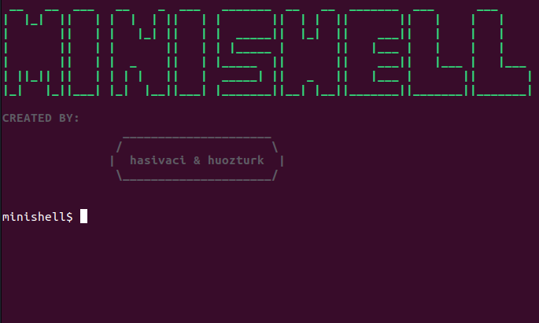

# 🐚 Minishell

**42 School projesi olarak geliştirilmiş basit bir shell programı**

Minishell, Unix shell'lerinin temel işlevselliğini taklit eden, C programlama dili ile yazılmış minimal bir shell uygulamasıdır. Bu proje, sistem programcılığı, process yönetimi, pipe'lar ve I/O redirection gibi işletim sistemi kavramlarını derinlemesine öğrenmeyi amaçlar.



## 📋 İçindekiler

- [✨ Özellikler](#-özellikler)
- [🏗️ Mimari](#️-mimari)
- [🛠️ Kurulum](#️-kurulum)
- [📖 Kullanım](#-kullanım)
- [💻 Built-in Komutlar](#-built-in-komutlar)
- [🔧 Teknolojiler](#-teknolojiler)
- [📁 Proje Yapısı](#-proje-yapısı)
- [🧪 Test](#-test)
- [👥 Katkıda Bulunanlar](#-katkıda-bulunanlar)

## ✨ Özellikler

### 🎯 Temel Shell İşlevleri
- **İnteraktif Komut Satırı**: Readline kütüphanesi ile gelişmiş komut satırı deneyimi
- **Komut Geçmişi**: Girilen komutların saklanması ve geri getirme
- **Prompt Gösterimi**: Kullanıcı dostu `minishell$ ` promptu

### 🔄 Komut İşleme
- **External Komut Yürütme**: Sistem PATH'inde bulunan tüm programların çalıştırılması
- **Argüman İşleme**: Komut argümanlarının doğru parsing'i ve işlenmesi
- **Çıkış Durumu Takibi**: Komutların exit status'ünün izlenmesi (`$?`)

### 🔗 Pipeline ve Redirection
- **Pipe Desteği**: Komutlar arası veri akışı (`|`)
- **Input Redirection**: Dosyadan girdi alma (`<`)
- **Output Redirection**: Dosyaya çıktı yönlendirme (`>`)
- **Append Redirection**: Dosyaya ekleme (`>>`)
- **Here Document**: Çoklu satır girdi (`<<`)

### 🔤 Quote ve Expansion İşlemleri
- **Single Quote**: Literal string işleme (`'...'`)
- **Double Quote**: Variable expansion ile string işleme (`"..."`)
- **Variable Expansion**: Environment variable'ların genişletilmesi (`$VAR`, `$?`)
- **Escape Sequences**: Özel karakterlerin escape edilmesi

### 🛠️ Built-in Komutlar
- `echo` - Metin çıktısı (`-n` flag desteği ile)
- `cd` - Dizin değiştirme (relative/absolute path desteği)
- `pwd` - Mevcut dizini gösterme
- `export` - Environment variable tanımlama
- `unset` - Environment variable silme
- `env` - Environment variable'ları listeleme
- `exit` - Shell'den çıkış

### 🎛️ Signal İşleme
- **SIGINT** (Ctrl+C): Mevcut komutu durdurma
- **SIGQUIT** (Ctrl+\\): Quit sinyali işleme
- **EOF** (Ctrl+D): Shell'den çıkış

## 🏗️ Mimari

Minishell, modüler bir mimari ile tasarlanmış olup şu ana bileşenlerden oluşur:

```
┌─────────────────┐    ┌─────────────────┐    ┌─────────────────┐
│     Lexer       │───▶│     Parser      │───▶│   Expander      │
│   (Tokenizer)   │    │  (AST Builder)  │    │ (Variable Exp.) │
└─────────────────┘    └─────────────────┘    └─────────────────┘
                                                        │
┌─────────────────┐    ┌─────────────────┐            ▼
│   Executor      │◀───│  Redirections   │◀───────────────────────
│  (Process Mgmt) │    │   (I/O Setup)   │
└─────────────────┘    └─────────────────┘
```

### 🧩 Modüler Yapı

1. **Lexer**: Girdi stringini tokenlarına ayırır
2. **Parser**: Token'ları komut yapılarına dönüştürür
3. **Expander**: Variable expansion ve quote işlemlerini gerçekleştirir
4. **Executor**: Komutları çalıştırır ve process yönetimi yapar
5. **Redirection**: I/O yönlendirmelerini yönetir
6. **Environment**: Environment variable işlemleri
7. **Signal Handler**: Sistem sinyallerini yönetir

## 🛠️ Kurulum

### Gereksinimler
- **GCC** compiler (C99 standartı)
- **Make** build system
- **Readline** kütüphanesi

### Ubuntu/Debian için readline kurulumu:
```bash
sudo apt-get update
sudo apt-get install libreadline-dev
```

### MacOS için readline kurulumu:
```bash
brew install readline
```

### Projeyi Klonlama ve Derleme
```bash
# Projeyi klonla
git clone https://github.com/username/minishell.git
cd minishell

# Projeyi derle
make

# Minishell'i çalıştır
./minishell
```

### Makefile Komutları
```bash
make          # Projeyi derle
make clean    # Object dosyalarını temizle
make fclean   # Tüm üretilen dosyları temizle
make re       # Temizle ve tekrar derle
```

## 📖 Kullanım

### Temel Komut Çalıştırma
```bash
minishell$ ls -la
minishell$ pwd
minishell$ echo "Hello, World!"
```

### Pipeline Kullanımı
```bash
minishell$ ls -l | grep ".c" | wc -l
minishell$ cat file.txt | sort | uniq
```

### Redirection İşlemleri
```bash
# Output redirection
minishell$ echo "Hello" > output.txt
minishell$ ls -l >> log.txt

# Input redirection
minishell$ sort < numbers.txt

# Here document
minishell$ cat << EOF
> Bu bir
> çoklu satır
> girdidir
> EOF
```

### Variable İşlemleri
```bash
minishell$ export MY_VAR="Hello World"
minishell$ echo $MY_VAR
minishell$ echo "Value: $MY_VAR"
minishell$ unset MY_VAR
```

### Built-in Komutlar
```bash
minishell$ cd /path/to/directory
minishell$ pwd
minishell$ env
minishell$ export PATH="/new/path:$PATH"
minishell$ exit 42
```

## 💻 Built-in Komutlar

### `echo [-n] [string ...]`
Argümanları standart çıktıya yazar.
- `-n`: Satır sonu karakteri yazmaz

### `cd [directory]`
Çalışma dizinini değiştirir.
- Argüman verilmezse `$HOME` dizinine gider
- `..` ile üst dizine çıkar
- Mutlak veya göreli path kabul eder

### `pwd`
Mevcut çalışma dizinini yazdırır.

### `export [name[=value] ...]`
Environment variable tanımlar veya mevcut değişkenleri listeler.

### `unset [name ...]`
Environment variable'ları siler.

### `env`
Tüm environment variable'ları listeler.

### `exit [n]`
Shell'den belirtilen çıkış kodu ile çıkar.

## 🔧 Teknolojiler

### Programlama Dili
- **C99**: Ana programlama dili
- **POSIX Uyumlu**: Taşınabilir sistem çağrıları

### Kütüphaneler
- **GNU Readline**: Komut satırı düzenleme ve geçmiş
- **Libft**: Özel C utility kütüphanesi
- **Standard C Library**: Temel sistem işlemleri

### Sistem Çağrıları
```c
// Process Management
fork(), execve(), waitpid()

// File Operations
open(), close(), read(), write()

// Directory Operations
chdir(), getcwd()

// Signal Handling
signal(), kill()

// Memory Management
malloc(), free()
```

### Derleyici Bayrakları
- `-Wall -Wextra -Werror`: Katı hata kontrolü
- `-std=c99`: C99 standart uyumluluğu

## 📁 Proje Yapısı

```
minishell/
├── 📄 Makefile                 # Build konfigürasyonu
├── 📄 README.md               # Proje dokümantasyonu
├── 📄 en_minishell.pdf        # Proje spesifikasyonu
│
├── 📁 include/
│   └── libft/                 # Özel C kütüphanesi
│       ├── *.c               # Libft fonksiyonları
│       ├── libft.h           # Libft header'ı
│       └── Makefile          # Libft build dosyası
│
├── 📁 lib/
│   └── minishell.h           # Ana header dosyası
│
└── 📁 source/
    ├── 📁 core/              # Ana program dosyaları
    │   ├── main.c            # Program giriş noktası
    │   └── print_welcome.c   # Karşılama mesajı
    │
    ├── 📁 lexer/             # Tokenization
    │   ├── lexer.c           # Ana lexer logic
    │   ├── tokenizer.c       # Token üretimi
    │   ├── token_handlers.c  # Token işleyiciler
    │   └── token_handlers_advanced.c
    │
    ├── 📁 parser/            # Command parsing
    │   ├── parser.c          # Ana parser logic
    │   ├── parser_utils.c    # Parser yardımcıları
    │   ├── parser_is.c       # Token tip kontrolleri
    │   └── command_utils.c   # Komut yapıları
    │
    ├── 📁 expander/          # Variable expansion
    │   ├── variable_expansion.c
    │   ├── quote_expansion.c
    │   ├── expansion_utils.c
    │   ├── argument_processor.c
    │   └── expand_utils.c
    │
    ├── 📁 executer/          # Command execution
    │   ├── executor.c        # Ana execution logic
    │   ├── execute_external.c
    │   ├── executor_utils.c
    │   ├── executer_utils2.c
    │   ├── executer_utils3.c
    │   └── pipeline_execution.c
    │
    ├── 📁 builtins/          # Built-in komutlar
    │   ├── builtins.c        # Ana built-in yönetimi
    │   ├── echo_builtin.c    # echo komutu
    │   ├── builtins_cd.c     # cd komutu
    │   ├── builtin_export.c  # export komutu
    │   ├── builtin_export_utils.c
    │   ├── path_built.c      # pwd komutu
    │   ├── builtins_utils.c  # exit, env komutları
    │   └── builtins_utils2.c # Built-in yardımcıları
    │
    ├── 📁 redirection/       # I/O redirection
    │   ├── redirections.c    # Ana redirection logic
    │   ├── redirections2.c   # Ek redirection işlemleri
    │   └── redirections_utils.c
    │
    ├── 📁 environment/       # Environment management
    │   ├── environment.c     # Env variable yönetimi
    │   ├── env_utils.c       # Env yardımcı fonksiyonlar
    │   ├── env_utils2.c      # Ek env işlemleri
    │   └── path_utils.c      # PATH işlemleri
    │
    ├── 📁 signal/           # Signal handling
    │   ├── signal_handler.c  # Ana signal yönetimi
    │   └── sigint.c         # SIGINT işleme
    │
    └── 📁 utils/            # Yardımcı fonksiyonlar
        ├── global_state.c    # Global state yönetimi
        └── debug_utils.c     # Debug araçları
```

## 🧪 Test

### Manuel Test Senaryoları

#### Temel Komutlar
```bash
# Echo testi
./minishell
minishell$ echo "Hello World"
minishell$ echo -n "No newline"

# Builtin komut testleri
minishell$ pwd
minishell$ cd ..
minishell$ pwd
minishell$ cd -
```

#### Pipeline Testleri
```bash
minishell$ ls -l | grep ".c"
minishell$ echo "hello world" | tr '[:lower:]' '[:upper:]'
minishell$ cat /etc/passwd | head -5 | tail -2
```

#### Redirection Testleri
```bash
minishell$ echo "test" > output.txt
minishell$ cat < output.txt
minishell$ ls -l >> log.txt
minishell$ cat << EOF
heredoc test
multiple lines
EOF
```

#### Environment Variable Testleri
```bash
minishell$ export TEST_VAR="Hello"
minishell$ echo $TEST_VAR
minishell$ echo "$TEST_VAR World"
minishell$ unset TEST_VAR
minishell$ echo $TEST_VAR
```

#### Signal Testleri
```bash
# SIGINT testi (Ctrl+C)
minishell$ sleep 10
^C

# EOF testi (Ctrl+D)
minishell$ [Ctrl+D]
exit
```

### Otomatik Test
```bash
# Basit test script'i
echo "ls -l | wc -l" | ./minishell
echo "echo 'Hello' > test.txt && cat test.txt" | ./minishell
```

## 🔍 Detaylı Teknik Bilgiler

### Memory Management
- **Garbage Collection**: Özel hafıza yönetim sistemi
- **Leak Prevention**: Tüm malloc'lar için karşılık gelen free işlemleri
- **Error Handling**: Robust hata yakalama ve temizlik

### Error Handling
```c
// Örnek hata yönetimi
if (!allocated_memory) {
    cleanup_and_exit();
    return (ERROR_CODE);
}
```

### Performance Optimizations
- **Efficient Tokenization**: Tek geçişte token üretimi
- **Minimal System Calls**: Gereksiz sistem çağrılarından kaçınma
- **Smart Memory Usage**: İhtiyaç duyulduğunda hafıza tahsisi

## 🤝 Katkıda Bulunma

Bu proje 42 School eğitim programı kapsamında geliştirilmiştir. Katkıda bulunmak isteyenler:

1. Projeyi fork edin
2. Feature branch oluşturun (`git checkout -b feature/amazing-feature`)
3. Değişikliklerinizi commit edin (`git commit -m 'Add some amazing feature'`)
4. Branch'i push edin (`git push origin feature/amazing-feature`)
5. Pull Request oluşturun

## 📜 Lisans

Bu proje 42 School kuralları çerçevesinde geliştirilmiştir. Eğitim amaçlı kullanım için uygundur.

## 🎯 Öğrenme Hedefleri

Bu projeyi tamamlayarak şu konularda derinlemesine bilgi sahibi olursunuz:

- **System Programming**: Unix sistem çağrıları ve process yönetimi
- **Shell Mechanics**: Shell'in iç çalışma prensipleri
- **Parser Design**: Lexical analysis ve syntax parsing
- **Memory Management**: C'de etkili hafıza yönetimi
- **Signal Handling**: Asenkron event işleme
- **File I/O**: Dosya işlemleri ve redirection
- **Process Communication**: Pipe ve IPC mekanizmaları

## 👥 Katkıda Bulunanlar

- **@huozturk** - Lead Developer
- **@hasivaci** - Lead Developer

---

