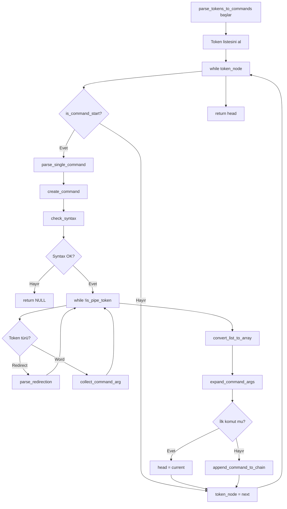
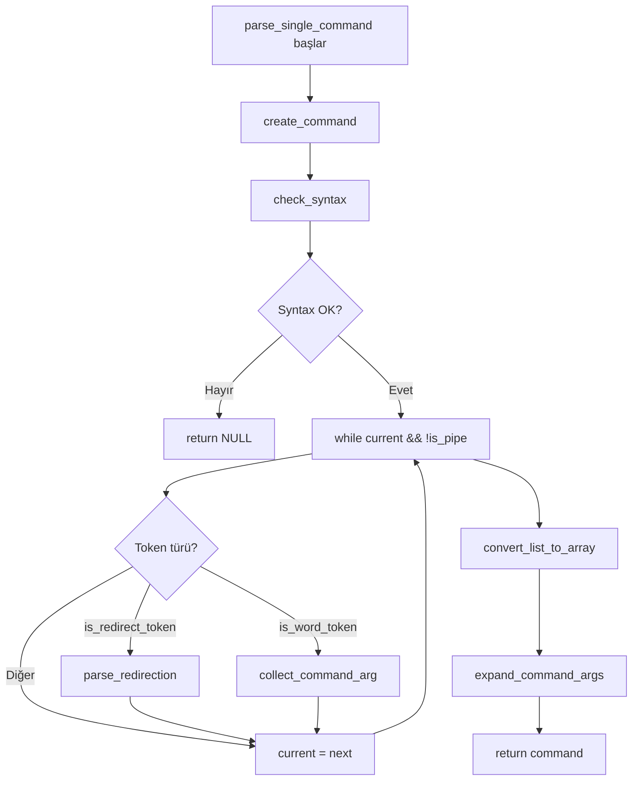

# 🧩 PARSER Modülü Detaylı Analizi

## 📋 İçindekiler
1. [Modül Genel Bakış](#modül-genel-bakış)
2. [parser.c - Ana Parser Fonksiyonları](#parserc---ana-parser-fonksiyonları)
3. [parser_is.c - Token Türü Kontrol Fonksiyonları](#parser_isc---token-türü-kontrol-fonksiyonları)
4. [command_utils.c - Komut Yardımcı Fonksiyonları](#command_utilsc---komut-yardımcı-fonksiyonları)
5. [Akış Şeması](#akış-şeması)
6. [Örnek Senaryolar](#örnek-senaryolar)

---

## 🎯 Modül Genel Bakış

Parser modülü, minishell'in **ikinci aşaması**dır. Bu modül:
- Lexer'dan gelen **token listesini** alır
- Token'ları **komut yapılarına** dönüştürür
- **Syntax kontrolü** yapar
- **Pipeline** yapısını oluşturur
- **Yönlendirmeleri** (redirection) organize eder

### 🎯 Parsing Nedir?
```
Tokens: [T_CMD:"ls", T_WORD:"-l", T_PIPE:"|", T_CMD:"grep", T_WORD:"txt"]
                              ↓
Commands: [ls -l] → [grep txt]  (Pipeline yapısı)
```

### 📁 Dosyalar
- `parser.c` - Ana parsing mantığı
- `parser_is.c` - Token türü kontrolleri
- `command_utils.c` - Komut yardımcı fonksiyonları

---

## 📄 parser.c - Ana Parser Fonksiyonları

### 🔧 Fonksiyon Hiyerarşisi
```
parse_tokens_to_commands()
├── is_command_start() - Token kontrol
├── parse_single_command() - Tek komut parsing
│   ├── create_command() - Komut yapısı oluştur
│   ├── check_syntax() - Syntax kontrol
│   ├── parse_redirection() - Yönlendirme işle
│   ├── collect_command_arg() - Argüman topla
│   ├── convert_list_to_array() - Liste → Array
│   └── expand_command_args() - Variable expansion
└── append_command_to_chain() - Komut zinciri
```

### 📝 Satır Satır Kod Analizi

#### 1. parse_tokens_to_commands Fonksiyonu (15-39. satırlar)

```c
t_command	*parse_tokens_to_commands(t_list *tokens, t_global *global)
{
    t_command	*head;       // İlk komut (pipeline başı)
    t_command	*current;    // Mevcut komut
    t_list		*token_node; // Token listesi iterator

    // ADIM 1: Değişkenleri başlat
    head = NULL;      // Henüz komut yok
    current = NULL;   // Mevcut komut yok
    token_node = tokens; // Token listesinin başından başla
	
    // ADIM 2: Tüm token'ları işle
    while (token_node) 
    {
        // ADIM 3: Bu token bir komutun başlangıcı mı?
        if (is_command_start(token_node))
        {
            // ADIM 4: Tek komut parse et
            current = parse_single_command(&token_node, global);
			if (!current)  // Parse başarısızsa
			{
				return (NULL); // Hata döndür
			}
			
            // ADIM 5: İlk komut mu yoksa pipeline'a mı ekle?
            if (!head)
                head = current;  // İlk komut - head olarak ata
            else
                append_command_to_chain(head, current); // Pipeline'a ekle
        }
        else 
            token_node = token_node->next; // Diğer token'a geç
    }
		
    return (head); // Komut zincirinin başını döndür
}
```

**🎯 Fonksiyon Amacı:**
Token listesini komut pipeline'ına dönüştürür. Ana parser fonksiyonu.

**🔗 Pipeline Yapısı:**
```c
// "ls -l | grep txt | wc -l" için:
head → [ls -l] → [grep txt] → [wc -l] → NULL
```

#### 2. check_syntax Fonksiyonu (40-82. satırlar)

```c
int	check_syntax(t_list **token_node)
{
	t_list		*token_temp; // Geçici token pointer
	t_token_new	*token_test; // Test edilen token

	token_temp = *token_node;
	
	// ADIM 1: Tüm token'ları kontrol et
	while (token_temp)
	{
	    token_test = (t_token_new *)token_temp->content;
		
		// ADIM 2: Redirection token'ları kontrol et
		if (token_test->type == T_REDIRECT_IN || token_test->type == T_REDIRECT_OUT 
		    || token_test->type == T_APPEND)
		{
			// ADIM 3: Sonraki token var mı?
			token_temp = token_temp->next;
			if (!token_temp)
			{
				printf("minishell: syntax error near unexpected token `newline'\n");
				return (1); // Syntax error
			}
			
			// ADIM 4: Sonraki token'ı al
			token_test = (t_token_new *)token_temp->content;
			
			// ADIM 5: Whitespace varsa atla
			if (token_test->type == T_WHITESPACE)
			{
				token_temp = token_temp->next;
				token_test = (t_token_new *)token_temp->content;
			}
			
			// ADIM 6: Dosya adı var mı kontrol et
			if (token_test->type != T_WORD)
			{
				printf("minishell: syntax error near unexpected token `%s'\n", 
				       token_test->value);
				return (1); // Syntax error
			}
			continue;
		}
		// ADIM 7: Heredoc token'ı kontrol et
		else if (token_test->type == T_HEREDOC)
		{
			token_temp = token_temp->next;
			if (!token_temp)
			{
				printf("minishell: syntax error near unexpected token `newline'\n");
				return (1); // Syntax error
			}
			token_test = (t_token_new *)token_temp->content;
			
			// ADIM 8: Heredoc delimiter kontrol et
			if (token_test->type != T_WORD && token_test->type != T_CMD)
			{
				printf("minishell: syntax error near unexpected token `%s'\n", 
				       token_test->value);
				return (1); // Syntax error
			}
			continue;
		}
		
		token_temp = token_temp->next;
	}
	return (0); // Syntax OK
}
```

**🎯 Fonksiyon Amacı:**
Bash-compatible syntax kontrolü yapar. Geçersiz syntax'ı tespit eder.

**⚠️ Kontrol Edilen Hatalar:**
- `cat >` (dosya adı eksik)
- `ls <<` (delimiter eksik)  
- `echo > |` (geçersiz token dizilimi)

#### 3. parse_single_command Fonksiyonu (84-135. satırlar)

```c
t_command	*parse_single_command(t_list **token_node, t_global *global)
{
    t_command	*cmd;       // Oluşturulacak komut
    t_list		*args_list; // Argüman listesi (geçici)
    t_list		*current;   // Mevcut token

    // ADIM 1: Komut yapısı oluştur
    cmd = create_command();
    if (!cmd)
        return (NULL);
        
    // ADIM 2: Değişkenleri başlat
    args_list = NULL;
    current = *token_node;
    
    // ADIM 3: Syntax kontrolü yap
	if (check_syntax(token_node))
	{
		return (NULL); // Syntax error
	}
	
    // ADIM 4: Pipe'a kadar olan token'ları işle
    while (current && !is_pipe_token(current))
    {
        // ADIM 5: Token türüne göre işle
        if (is_redirect_token(current))
            parse_redirection(cmd, &current, global); // Redirection ekle
        else if (is_word_token(current))
            collect_command_arg(&args_list, current); // Argüman ekle
            
		current = current->next; // Sonraki token'a geç
    }
    
    // ADIM 6: Argüman listesini array'e çevir
    cmd->args = convert_list_to_array(args_list);
    
    // ADIM 7: Token pointer'ını güncelle
    *token_node = current; // Pipe veya NULL
    
    // ADIM 8: Geçici listeyi temizle
    ft_lstclear(&args_list, free);
    
    // ADIM 9: Variable expansion uygula
    expand_command_args(cmd, global);
    
    return (cmd);
}
```

**🎯 Fonksiyon Amacı:**
Tek bir komut (pipe'lar arası) parse eder. Argümanları ve yönlendirmeleri organize eder.

**🔄 İşlem Akışı:**
1. **Başlat** → Boş komut yapısı oluştur
2. **Kontrol** → Syntax doğruluğunu kontrol et
3. **Döngü** → Pipe'a kadar tüm token'ları işle
4. **Organize** → Argümanları ve redirection'ları ayır
5. **Dönüştür** → Liste yapısını array'e çevir
6. **Genişlet** → Variable expansion uygula

#### 4. parse_redirection Fonksiyonu (137-159. satırlar)

```c
void	parse_redirection(t_command *cmd, t_list **token_node, t_global *global)
{
    t_redirect		*redirect;   // Yönlendirme yapısı
    t_token_new		*token;      // Mevcut token (>, <, >>, <<)
    t_token_new		*file_token; // Dosya adı token'ı

    (void)global;  // Şimdilik kullanılmıyor
    
    // ADIM 1: Redirection token'ını al
    token = (t_token_new *)(*token_node)->content;
    
    // ADIM 2: Redirection yapısı oluştur
    redirect = halloc(sizeof(t_redirect));
    if (!redirect)
        return ;
        
    // ADIM 3: Redirection özelliklerini ayarla
    redirect->type = token->type;    // <, >, >>, << türü
    redirect->fd = -1;               // Henüz FD yok
    redirect->next = NULL;           // Liste sonu
    
    // ADIM 4: Sonraki token'a geç (dosya adı)
    *token_node = (*token_node)->next;
    if (*token_node)
    {
        file_token = (t_token_new *)(*token_node)->content;
        
        // ADIM 5: Whitespace varsa atla
		if (file_token->type == T_WHITESPACE)
		{
			*token_node = (*token_node)->next;
	        file_token = (t_token_new *)(*token_node)->content;
		}
		
        // ADIM 6: Dosya adını kopyala
        redirect->filename = ft_strdup(file_token->value);
    }
    
    // ADIM 7: Redirection'ı komuta ekle
    add_redirect_to_command(cmd, redirect);
}
```

**🎯 Fonksiyon Amacı:**
Yönlendirme token'larını (>, <, >>, <<) işler ve komuta ekler.

**📊 Redirection Yapısı:**
```c
typedef struct s_redirect
{
    t_token_types type;     // T_REDIRECT_OUT, T_REDIRECT_IN, vb.
    char *filename;         // "output.txt", "input.txt"
    int fd;                 // File descriptor (execution sırasında)
    struct s_redirect *next; // Sonraki redirection
} t_redirect;
```

#### 5. collect_command_arg Fonksiyonu (162-186. satırlar)

```c
void	collect_command_arg(t_list **args_list, t_list *token_node)
{
    t_token_new	*token;     // İşlenecek token
    char		*arg_copy;  // Kopyalanacak argüman
    char		*temp;      // Geçici string

    token = (t_token_new *)token_node->content;
    
    // ADIM 1: Token türüne göre işle
    if (token->type == T_SINGLE_QUOTE)
    {
        // ADIM 2: Tek tırnak - tırnakları koruyarak ekle
        temp = ft_strjoin("\'", token->value);
        arg_copy = ft_strjoin(temp, "\'");
        // Expansion'da literal olarak işlenecek
    }
    else if (token->type == T_DOUBLE_QUOTE)
    {
        // ADIM 3: Çift tırnak - tırnakları koruyarak ekle
        temp = ft_strjoin("\"", token->value);
        arg_copy = ft_strjoin(temp, "\"");
        // Expansion'da variable expansion yapılacak
    }
    else
    {
        // ADIM 4: Normal word - olduğu gibi kopyala
        arg_copy = ft_strdup(token->value);
    }
    
    // ADIM 5: Argümanı listeye ekle
    ft_lstadd_back(args_list, ft_lstnew(arg_copy));
}
```

**🎯 Fonksiyon Amacı:**
Token'ları argüman listesine ekler. Tırnak işaretlerini korur.

**💡 Tırnak İşleme:**
- `'hello'` → `'hello'` (literal işareti)
- `"$HOME"` → `"$HOME"` (expansion işareti)
- `hello` → `hello` (normal word)

---

## 📄 parser_is.c - Token Türü Kontrol Fonksiyonları

### 📝 Satır Satır Kod Analizi

#### 1. is_command_start Fonksiyonu (15-22. satırlar)

```c
int	is_command_start(t_list *token_node)
{
    t_token_new	*token;

    // ADIM 1: Token geçerli mi kontrol et
    if (!token_node)
        return (0);
        
    // ADIM 2: Token'ı al
    token = (t_token_new *)token_node->content;
    
    // ADIM 3: Komut başlangıcı mı kontrol et
    return (token->type == T_WORD || token->type == T_CMD || 
            token->type == T_HEREDOC || token->type == T_REDIRECT_OUT || 
            token->type == T_REDIRECT_IN);
}
```

**🎯 Fonksiyon Amacı:**
Token'ın yeni bir komutun başlangıcı olup olmadığını kontrol eder.

**✅ Komut Başlangıcı Sayılan Token'lar:**
- `T_WORD` / `T_CMD` → Normal komutlar
- `T_REDIRECT_*` → Redirection ile başlayan komutlar
- `T_HEREDOC` → Heredoc ile başlayan komutlar

#### 2. is_pipe_token Fonksiyonu (24-34. satırlar)

```c
int	is_pipe_token(t_list *token_node)
{
    t_token_new	*token;
	t_global *global;

	global = get_global();
	
    // ADIM 1: Token geçerli mi kontrol et
    if (!token_node)
        return (0);
        
    // ADIM 2: Token'ı al
    token = (t_token_new *)token_node->content;
    
    // ADIM 3: Pipe token'ı mı ve echo flag'ini sıfırla
	if (token->type == T_PIPE)
		global->echo_flag = 0; // Echo modundan çık
		
    return (token->type == T_PIPE);
}
```

**🎯 Fonksiyon Amacı:**
Token'ın pipe olup olmadığını kontrol eder. Echo flag'ini yönetir.

#### 3. is_redirect_token Fonksiyonu (36-45. satırlar)

```c
int	is_redirect_token(t_list *token_node)
{
    t_token_new	*token;

    // ADIM 1: Token geçerli mi kontrol et
    if (!token_node)
        return (0);
        
    // ADIM 2: Token'ı al
    token = (t_token_new *)token_node->content;
    
    // ADIM 3: Redirection token'ı mı kontrol et
    return (token->type == T_REDIRECT_IN || token->type == T_REDIRECT_OUT
        || token->type == T_APPEND || token->type == T_HEREDOC);
}
```

**🎯 Fonksiyon Amacı:**
Token'ın yönlendirme operatörü olup olmadığını kontrol eder.

#### 4. is_word_token Fonksiyonu (47-71. satırlar)

```c
int	is_word_token(t_list *token_node)
{
    t_token_new	*token;
	t_global	*global;

	global = get_global();
	
    // ADIM 1: Token geçerli mi kontrol et
    if (!token_node)
        return (0);
        
    // ADIM 2: Token'ı al
    token = (t_token_new *)token_node->content;
    
    // ADIM 3: Echo komutu mu kontrol et
	if (!ft_strcmp(token->value, "echo"))
		global->echo_flag = 1; // Echo moduna gir

    // ADIM 4: Echo modundaysa whitespace'leri de kabul et
	if (global->echo_flag)
	{
		return (token->type == T_WORD || token->type == T_SINGLE_QUOTE || 
		        token->type == T_DOUBLE_QUOTE || token->type == T_WHITESPACE || 
		        token->type == T_CMD);
	}
	
	// ADIM 5: Normal modda whitespace'leri kabul etme
	return (token->type == T_WORD || token->type == T_SINGLE_QUOTE || 
            token->type == T_DOUBLE_QUOTE || token->type == T_CMD);
}
```

**🎯 Fonksiyon Amacı:**
Token'ın kelime/argüman olup olmadığını kontrol eder. Echo özel durumunu handle eder.

**💡 Echo Özel Durumu:**
```bash
echo "hello    world"  # Multiple space'ler korunmalı
echo hello   world     # Normal mode'da space'ler ignore edilir
```

---

## 📄 command_utils.c - Komut Yardımcı Fonksiyonları

### 📝 Satır Satır Kod Analizi

#### 1. convert_list_to_array Fonksiyonu (15-35. satırlar)

```c
char	**convert_list_to_array(t_list *args_list)
{
    char	**args_array; // Sonuç array'i
    int		size;         // Liste boyutu
    int		i;            // Index counter
    t_list	*current;     // Liste iterator

    // ADIM 1: Liste boyutunu hesapla
    size = ft_lstsize(args_list);
    
    // ADIM 2: Array için memory allocate et
    args_array = halloc(sizeof(char *) * (size + 1)); // +1 NULL terminator için
    if (!args_array)
        return (NULL);
        
    // ADIM 3: Liste elemanlarını array'e kopyala
    i = 0;
    current = args_list;
    while (current)
    {
        args_array[i] = ft_strdup((char *)current->content); // String kopyala
        current = current->next;
        i++;
    }
    
    // ADIM 4: NULL terminator ekle
    args_array[i] = NULL;
    
    return (args_array);
}
```

**🎯 Fonksiyon Amacı:**
Linked list'teki argümanları execve() için uygun array formatına çevirir.

**📊 Dönüşüm Örneği:**
```c
// Liste: [hello] → [world] → [!] → NULL
// Array: ["hello", "world", "!", NULL]
```

#### 2. append_command_to_chain Fonksiyonu (37-44. satırlar)

```c
void	append_command_to_chain(t_command *head, t_command *new_cmd)
{
    t_command	*current; // Liste iterator

    // ADIM 1: Liste başından başla
    current = head;
    
    // ADIM 2: Liste sonunu bul
    while (current->next)
        current = current->next;
        
    // ADIM 3: Yeni komutu sona ekle
    current->next = new_cmd;
}
```

**🎯 Fonksiyon Amacı:**
Yeni komutları pipeline zincirine ekler.

**🔗 Pipeline Oluşturma:**
```c
// head → [ls] → NULL
// append_command_to_chain(head, grep_cmd)
// head → [ls] → [grep] → NULL
```

#### 3. add_redirect_to_command Fonksiyonu (46-49. satırlar)

```c
void	add_redirect_to_command(t_command *cmd, t_redirect *redirect)
{
    // Redirection'ı komutun redirection listesine ekle
    ft_lstadd_back(&cmd->redirections, ft_lstnew(redirect));
}
```

**🎯 Fonksiyon Amacı:**
Yönlendirmeleri komutun redirection listesine ekler.

---

## 🔄 Akış Şeması

### Ana Parsing Akışı


### Single Command Parsing Detayı


---

## 🎬 Örnek Senaryolar

### Senaryo 1: Basit Komut
```bash
Input Tokens: [T_CMD:"ls", T_WHITESPACE:" ", T_WORD:"-l"]
```

**Parsing Süreci:**
1. `is_command_start(T_CMD:"ls")` → true
2. `parse_single_command()` çağrılır
3. `create_command()` → Boş komut oluştur
4. `check_syntax()` → OK
5. `T_CMD:"ls"` → `collect_command_arg()` → args_list'e ekle
6. `T_WHITESPACE` → Skip (echo modunda değil)
7. `T_WORD:"-l"` → `collect_command_arg()` → args_list'e ekle
8. `convert_list_to_array()` → `["ls", "-l", NULL]`

**Sonuç:**
```c
t_command {
    args: ["ls", "-l", NULL],
    redirections: NULL,
    next: NULL
}
```

### Senaryo 2: Pipeline
```bash
Input Tokens: [T_CMD:"cat", T_WORD:"file.txt", T_PIPE:"|", T_CMD:"grep", T_WORD:"hello"]
```

**Parsing Süreci:**
1. **İlk Komut:**
   - `is_command_start(T_CMD:"cat")` → true
   - `parse_single_command()` → `["cat", "file.txt", NULL]`
   - `head = first_command`

2. **Pipe Detection:**
   - `T_PIPE` bulundu → `parse_single_command` bitir
   - `token_node` pipe'ın ötesine ilerle

3. **İkinci Komut:**
   - `is_command_start(T_CMD:"grep")` → true
   - `parse_single_command()` → `["grep", "hello", NULL]`
   - `append_command_to_chain(head, second_command)`

**Sonuç:**
```c
head → {
    args: ["cat", "file.txt", NULL],
    next: {
        args: ["grep", "hello", NULL],
        next: NULL
    }
}
```

### Senaryo 3: Redirection
```bash
Input Tokens: [T_CMD:"cat", T_REDIRECT_IN:"<", T_WORD:"input.txt", T_REDIRECT_OUT:">", T_WORD:"output.txt"]
```

**Parsing Süreci:**
1. `T_CMD:"cat"` → `collect_command_arg()` → args: ["cat"]
2. `T_REDIRECT_IN:"<"` → `parse_redirection()`:
   - redirect.type = T_REDIRECT_IN
   - redirect.filename = "input.txt"
   - Add to cmd->redirections
3. `T_REDIRECT_OUT:">"` → `parse_redirection()`:
   - redirect.type = T_REDIRECT_OUT  
   - redirect.filename = "output.txt"
   - Add to cmd->redirections

**Sonuç:**
```c
t_command {
    args: ["cat", NULL],
    redirections: [
        {type: T_REDIRECT_IN, filename: "input.txt"},
        {type: T_REDIRECT_OUT, filename: "output.txt"}
    ],
    next: NULL
}
```

### Senaryo 4: Quote Handling
```bash
Input Tokens: [T_CMD:"echo", T_SINGLE_QUOTE:"hello world", T_DOUBLE_QUOTE:"$HOME"]
```

**Parsing Süreci:**
1. `T_CMD:"echo"` → `collect_command_arg()` → args: ["echo"]
2. `T_SINGLE_QUOTE:"hello world"` → `collect_command_arg()`:
   - `ft_strjoin("'", "hello world")` → `"'hello world"`
   - `ft_strjoin("'hello world", "'")` → `"'hello world'"`
3. `T_DOUBLE_QUOTE:"$HOME"` → `collect_command_arg()`:
   - `ft_strjoin("\"", "$HOME")` → `"\"$HOME"`
   - `ft_strjoin("\"$HOME", "\"")` → `"\"$HOME\""`

**Sonuç:**
```c
t_command {
    args: ["echo", "'hello world'", "\"$HOME\"", NULL],
    redirections: NULL,
    next: NULL
}
```

### Senaryo 5: Syntax Error
```bash
Input Tokens: [T_CMD:"cat", T_REDIRECT_OUT:">", T_PIPE:"|"]
```

**Parsing Süreci:**
1. `check_syntax()` çağrılır
2. `T_REDIRECT_OUT` bulundu → Sonraki token kontrol et
3. Sonraki token `T_PIPE` → T_WORD değil!
4. `printf("minishell: syntax error near unexpected token `|'\n")`
5. `return (1)` → Syntax error

**Sonuç:**
```
minishell: syntax error near unexpected token `|'
NULL döndürülür
```

---

## 🎯 Önemli Noktalar

### 1. Command Yapısı
```c
typedef struct s_command
{
    char **args;              // ["ls", "-l", NULL]
    t_list *redirections;     // Yönlendirmeler listesi
    int pipe_fd[2];          // Pipe file descriptors
    pid_t pid;               // Process ID (execution sırasında)
    struct s_command *next;   // Pipeline'daki sonraki komut
} t_command;
```

### 2. Redirection Yapısı
```c
typedef struct s_redirect
{
    t_token_types type;       // T_REDIRECT_IN, T_REDIRECT_OUT, vb.
    char *filename;           // "output.txt", "input.txt"
    int fd;                   // File descriptor (execution sırasında)
    struct s_redirect *next;  // Sonraki redirection
} t_redirect;
```

### 3. Syntax Validation
```c
// Kontrol edilen hatalar:
// - Redirection sonrası eksik dosya adı
// - Heredoc sonrası eksik delimiter
// - Geçersiz token kombinasyonları
```

### 4. Quote Preservation
```c
// Parser quote'ları korur:
'hello' → "'hello'"    // Literal flag
"$HOME" → "\"$HOME\""  // Expansion flag
hello   → "hello"      // Normal word
```

### 5. Pipeline Organization
```c
// Pipeline yapısı:
head → cmd1 → cmd2 → cmd3 → NULL
// Her komut bağımsız args ve redirections'a sahip
```

### 6. Error Handling
```c
// Parser error handling:
if (!cmd) return (NULL);           // Memory allocation error
if (check_syntax()) return (NULL); // Syntax error
// Global exit_status = 2 (syntax error code)
```

### 7. Echo Special Case
```c
// Echo komutu için özel whitespace handling:
echo "hello    world"  // Multiple space korunur
other_cmd hello world  // Space'ler normalize edilir
```

Bu parser modülü, token'ları executable komut yapılarına dönüştürür ve execution için hazırlar.
